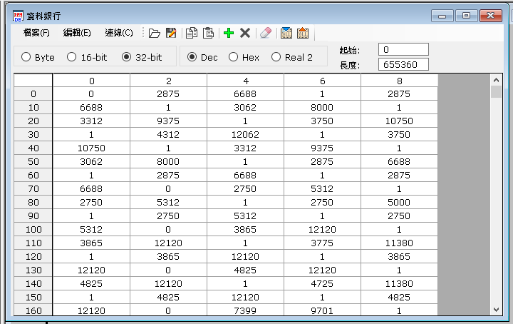

# VigorDataBankDLL 是可以支援Vigor PLC ， 由此擴充庫直接生成資料銀行，省去了開發者在數據編輯以及生成上的麻煩
# !!!可以自己換算Byte寫入各種格式int16,32,64...等等!!!
# 如有特殊問題請在聯繫我 email: asd281194533@gmail.com

## Function
- WriteHex 寫入資料銀行DB檔案，若不存在則生成
- ReadHex 讀取資料銀行Header

## 使用方法

### 第一步 寫程式
``` C#
public void CreateDataBank(){
    List<byte> TotalData = new List<byte>();
    TotalData.add(1);
    TotalData.add(2);
    TotalData.add(3);
    
    //指定創建路徑
    string path = "C:\\Users\\PC\\Downloads\\BigData1.DB";
    //初始化擴充件
    var vigor = new VigorDataBnakDLL.VigorDataBankDLL();
    //創建資料銀行DB (參數1 檔案路徑，參數二 資料)
    vigor.WriteHex(path , TotalData );
}
```

### 第二步 打開LadderMasterS.exe(Vigor編輯器)
- 在工具列找到工具這個選單
- 點擊資料銀行
- 點擊檔案
- 點擊開啟舊檔
- enjoy!

### 成品圖(下面的數據不是123是，因為此處的資料我寫的不是123)


